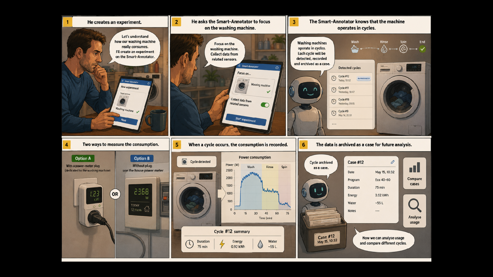
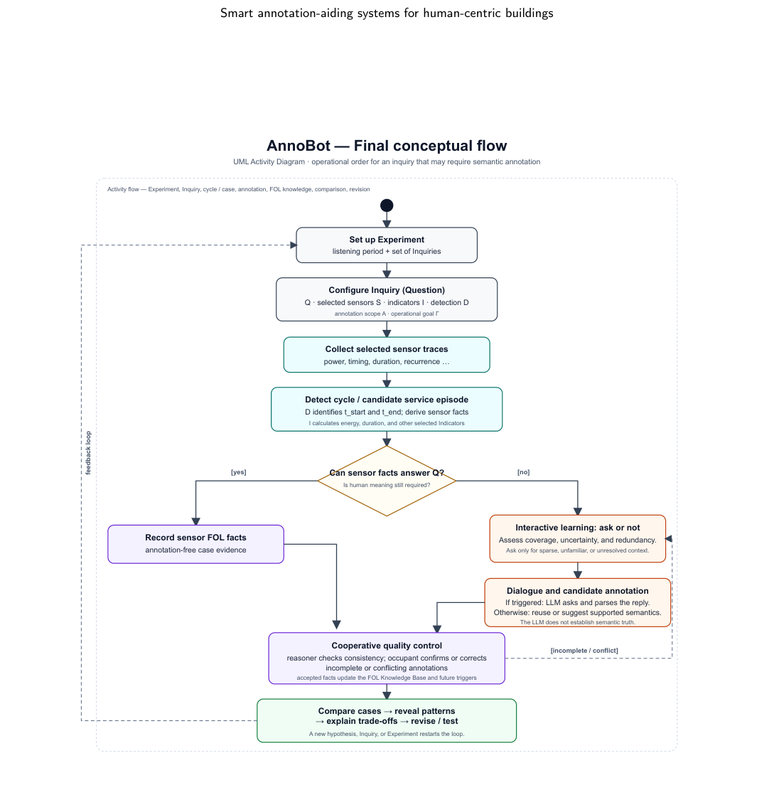

# Problem Formulation

[[Annotation aid system index|Index]] | [[02-related-works|Previous]] | [[04-proposed-framework|Next]]

Following the assumption by del Castillo Cardoso (2025), occupants are not only passive recipients of automated smart-home services, but can also act as intentional learners who actively question, observe, and reflect on their own residential behaviors. In everyday life, occupants may naturally wonder how much energy is consumed by household activities, how specific appliances or services operate, and how changes in these services may affect both energy consumption and indoor environmental quality. For example, an occupant may ask whether a certain washing-machine mode is more energy-efficient, whether opening windows at specific times improves comfort, or whether a particular routine increases electricity usage.

### 3.1. From self-experimentation to occupant-driven inquiry in smart homes

The idea that individuals can generate scientific knowledge by experimenting on themselves has a long history. Selfexperimentation has been widely practiced in medicine, physiology, and psychology, where researchers voluntarily become the subjects of their own investigations. Although this practice dates back several centuries, it was first comprehensively analyzed by (?), who described self-experimentation as an important yet underappreciated scientific tradition. In this context, the objective of self-experimentation is not merely to collect observations but to test hypotheses under controlled conditions while reducing experimental uncertainty. More recently, self-experimentation has re-emerged through the Quantified Self movement (?) and personal science (?), where individuals use digital technologies to investigate questions about their own health, behavior, or lifestyle. These approaches emphasize that scientific inquiry can be conducted by non-experts using personal data collected in everyday life. The proposed framework shares the principle that the individual is both the investigator and the subject of the investigation, but extends it beyond personal health toward domestic energy services. Rather than studying physiological responses, occupants investigate how their own activities influence comfort, building services, and resource consumption within their everyday living environment. The home therefore becomes an instrumented environment supporting systematic observation and experimentation. This perspective is closely related to Dewey’s theory of inquiry (?), in which knowledge emerges from the investigation of an indeterminate situation through observation, experimentation, and reflection. Inquiry is initiated by a meaningful question arising from practical experience and progresses through the deliberate collection of evidence until a satisfactory explanation is obtained. Rather than prescribing optimal behaviors, inquiry supports understanding by enabling individuals to relate their actions to their observed consequences. This pragmatic view provides an appropriate conceptual foundation for occupant-centred smart-home systems because the objective is not to optimize behavior automatically but to support occupants in understanding their own energy practices. Current smart-home research adopts a substantially different perspective. Most energy management systems rely on sensor data, predictive models, and optimization algorithms to automatically control building services or recommend energy-efficient actions. Occupants are generally considered as passive data providers or recipients of recommendations, while annotations are primarily used to construct labelled datasets for activity recognition, occupancy detection, or supervised learning. Consequently, data acquisition is driven by the requirements of machine learning models rather than by the information needs of occupants. The proposed framework departs from this paradigm by organizing data acquisition around an Experiment: a timebounded listening period, set up by an occupant, that groups one or more concrete Inquiries. Each inquiry originates from a question that the occupant wishes to answer and specifies the observations, contextual information, and semantic annotations required to answer that question within the experiment’s listening period. Sensor measurements therefore no longer constitute an end in themselves but become evidence supporting a structured investigation. Similarly, annotations are not merely labels for training predictive models but semantic explanations that contextualize observations and enable their interpretation. This shift transforms the smart annotation-aiding system from a passive data collection framework into an interactive knowledge acquisition process, where occupants progressively build an understanding of what constitutes an appropriate, acceptable, and sufficient level of service within their own homes.

This perspective naturally introduces the notion of an inquiry: an occupant-driven investigation, configured inside an experiment, centred on a question they wish to answer. Typical questions could be how much lowering a thermostat setpoint affects perceived comfort and energy consumption, or whether an alternative dishwasher programme remains satisfactory while reducing energy consumption, or whether shifting appliance operation to another period influences household routines. A single experiment can group several such inquiries under one listening period; for instance, the same two-week meeting-room experiment can simultaneously investigate several distinct questions about occupancy, energy sources, comfort trade-offs, or anomalies (Section 5.2). An inquiry provides the semantic context that gives meaning to sensor observations. Instead of continuously acquiring all available data, the system collects only the information specified by the occupant to answer their question, i.e., which sensors should be monitored, which quantities should be compared or aggregated to assess the outcome, how a relevant service episode should be detected and bounded within the experiment’s listening period, and which semantic dimensions require annotation. For instance, an inquiry about the washing machine detects one washing-machine cycle as its service episode, while an inquiry about the HVAC system relies on a listening period spanning one day, from 3am to 3am the next day, inherited from its experiment. It therefore guides the complete information acquisition process, from sensor selection and cycle detection to annotation and data interpretation. Each inquiry is realized through its experiment’s listening period: sensor observations constitute empirical evidence, annotations provide semantic explanations when required, and the resulting sensor-based or annotated situations become cases that can later be compared with similar inquiries. In this way, an experiment transforms isolated measurements into interpretable knowledge that supports learning, explanation, and informed decision-making across all of its inquiries. This organization differs fundamentally from traditional data annotation systems. Conventional annotation frameworks are centred on datasets whose primary objective is to produce labelled examples for supervised learning. In contrast, the proposed framework is organized around occupant-defined inquiries, each configured inside an experiment, designed to answer meaningful questions about domestic energy services. Annotation is therefore not an end in itself, but one component of a broader inquiry process through which occupants progressively discover what constitutes an appropriate, acceptable, and sufficient level of service within their own homes. An experiment groups the inquiries an occupant configures during one overall listening period: 𝐸= ⟨, 𝑇⟩, = {𝜄1, … , 𝜄𝑛}, (1) where 𝑇is the experiment-level listening period (Section 3.1.4) and each 𝜄𝑗∈is one inquiry (question) configured within the experiment; denotes the set of inquiries, not a set of indicators. Each inquiry conducted by an occupant to investigate an empirical energy-related question in a real residential environment is formally defined as the tuple 𝜄= ⟨𝑄, 𝑆, 𝐼, 𝐷, 𝐴, Γ⟩, (2) where 𝑄denotes the inquiry question expressed in natural language, 𝑆represents the selected sensors configuration, 𝐼 denotes the indicators used to compare or assess the outcome, 𝐷specifies how a relevant service episode (cycle or case) is detected and temporally bounded within the experiment’s listening period, 𝐴denotes the semantic annotation scope required beyond what 𝑆can provide, and Γ denotes the inquiry goal, that is, the underlying hypothesis or decision problem that the inquiry aims to address. The components 𝑄, 𝑆, 𝐷and 𝐼are formally described in Sections 3.1.1, 3.1.2, and 3.1.3, respectively; the experiment-level listening period 𝑇is described in Section 3.1.4. Distinguishing 𝑄from Γ is important: 𝑄is the natural-language formulation posed by the occupant, whereas Γ captures the operational objective that later drives annotation triggers, chatbot interaction, and case retrieval. Table 2 illustrates this distinction with representative examples. Table 2: Examples of experiment questions 𝑄and corresponding inquiry goals Γ. Experiment question 𝑄 Inquiry goal Γ Which washing mode is more economical? Compare washing modes Can I reduce the setpoint by 1◦C? Evaluate comfort-energy trade-off Why was yesterday’s electricity consumption unusually high? Explain an anomaly

The purpose of the experiment is not to control the occupant’s behavior automatically, but to support the occupant in collecting relevant evidence, observing the consequences of everyday actions, and gradually understanding the relationship between residential context, appliance usage, energy consumption, and comfort-related outcomes. This assumption is consistent with the notion of intentional learners, where occupants actively participate in understanding their own living environment rather than merely following system-generated recommendations. Data are collected into cases. A case is a collection of sensor observations, contextual information, and semantic annotations that are relevant to the inquiry goal. A case is built up as sensor trace →detected cycle / service episode →case evidence →(optional accepted annotations) →annotated case, where the annotation step is optional: when the inquiry question can be answered from sensor evidence alone, the detected episode already constitutes a valid, sensor-based case, and it becomes an annotated case only once accepted semantic annotations are attached to it. Cases are used to compare and analyze the results of different experiments. They can be displayed to the occupant to help them understand the relationship between their actions and the outcomes of their experiments (?), or used to develop a case-based reasoning system to answer questions about future actions (?), etc...

#### 3.1.1. Experiment Question

The inquiry question 𝑄defines the main empirical inquiry that the occupant aims to investigate. It guides which information is relevant to collect and determines the level of semantic detail required to characterize residential facts. In this framework, 𝑄is not only a textual question, but also a mechanism for delimiting the annotation scope, since occupants may choose which semantic dimensions are necessary for their experiment, such as the 5W1H dimensions: Who, What, Where, When, Why, and How. The definition of 𝑄also determines how annotations are processed. Depending on the required level of contextual information, the framework distinguishes between two recognition strategies: 1. Annotation-free recognition: When the inquiry question can be answered using sensor data alone, explicit occupant annotations are not required. In this case, raw sensor streams are processed through signature extractors, which transform sensor measurements into interpretable representations of facts, such as detecting whether an appliance is ON or OFF. 2. Annotation-based recognition: When the inquiry question requires contextual or semantic information that cannot be inferred directly from sensors, occupant annotations become necessary. For example, a sensor may detect that a washing machine is operating, but it cannot determine the selected washing program or the occupant’s intention. In such cases, the system requests semantic annotations to enrich the sensor-based facts.

*Figure 1:* Illustrative use case of defining a washing-machine experiment and archiving detected washing cycles as cases for later analysis. Figure 1 illustrates a washing-machine use case in which an occupant creates an inquiry, selects the washing machine as the target appliance, and allows the system to collect data from related sensors. The system then detects washing cycles from appliance operation patterns, records consumption-related attributes, and archives each detected cycle as a case for future comparison and analysis. For example, consider the same residential activity: using the washing machine. If the occupant asks: When does the washing machine operate, and how much energy does each cycle consume? The required annotation scope is relatively narrow. The system mainly needs to detect washing-machine operation from power-consumption signatures, segment each cycle, and archive factual attributes such as start time, end time, duration, and energy consumption. In this case, the relevant dimensions are mostly What, When, and possibly How, where How refers to measurable operational patterns such as power profile or cycle duration. Since these facts can be derived from sensor data, the system may adopt an annotation-free recognition strategy. In contrast, if the occupant asks: For regular laundry and bedding laundry, which washing mode is more energy-efficient? The annotation scope becomes broader. The system may still detect the same washing-machine cycles from sensor data, but answering this question now requires additional semantic information that sensors alone cannot reliably provide. For instance, the system needs to know whether each cycle was used for regular clothes or bedding items such as blankets, pillows, or mattress covers. It may also need to record the selected washing mode, load type, and possibly load size in order to compare energy consumption across different usage contexts. In this case, the relevant dimensions expand beyond What and When to include more detailed forms of How, such as the washing mode, and Why, such as the purpose of the cycle. Therefore, occupant annotation becomes necessary. Therefore, 𝑄plays a central role in both defining the purpose of the experiments and selecting the appropriate annotation strategy, while Γ keeps the downstream interaction and retrieval mechanisms aligned with the underlying inquiry goal.

#### 3.1.2. Sensors Configuration

The sensors configuration 𝑆defines the set of sensors selected to support a given inquiry. Rather than considering all sensors deployed in the residence, each experiment focuses only on the sensors that are relevant to the occupant’s question. The definition of 𝑆determines which observations are collected and processed for the experiment. This allows different empirical questions to be studied independently, each with its own appropriate set of sensors and corresponding characterization. For example, an experiment about the energy impact of washing machine configurations may focus on laundry-related sensors, while an experiment about cooking-related energy use may rely on kitchen appliances and environmental sensors. Figure 1 illustrates this configuration through the washing-machine use case. Once the occupant defines an inquiry about washing-machine usage, the system does not need to collect data from all household sensors. Instead, it focuses on laundry-related sensors that can provide evidence about the operation of the washing machine. Depending on the available installation, this may include a dedicated power-meter plug attached to the washing machine, or a householdlevel power meter from which washing-machine signatures can be extracted. Thus, 𝑆constrains the data acquisition and analysis process by selecting only the sensor information required to answer the inquiry question.

#### 3.1.3. Cycle or Case Detection and Indicators

𝐷specifies how a relevant service episode, or cycle, is detected and temporally bounded inside the experiment’s listening period. Detection returns the episode boundaries 𝑡start and 𝑡end from the observed sensor traces; for a washing machine or dishwasher, a power profile lets a smart plug identify when the appliance started and stopped operating. 𝐼is distinct from 𝐷: while 𝐷identifies and bounds the episode, 𝐼defines the quantities used to compare or assess it. For a power signal 𝑃(𝑡) observed over the interval returned by 𝐷, the cycle energy indicator is 𝐸cycle = 1 3600 ∫ 𝑡end 𝑡start 𝑃(𝑡) 𝑑𝑡 [Wh], (3)

with 𝑃expressed in watts and 𝑡in seconds. Detection therefore supplies the integration bounds, while the indicator computes the comparison value; a single inquiry may define several indicators over the same detected episode, for example the peak power and the total energy consumed.

#### 3.1.4. Temporal Horizon

The experiment start and stop conditions 𝑇−and 𝑇+ define the overall period during which the experiment is observed and analyzed. This period, referred to as the listening period, is configured once for the experiment and shared by all of the inquiries it contains: it allows occupants to specify when the system should collect data relevant to any of those inquiries. It can be defined in terms of start and end dates, selected days of the week, and specific intra-day time intervals, consumption thresholds, triggering annotations, etc.... The experiment-level listening period must not be confused with a detected cycle or service episode: the listening period can span, for example, an entire two-week meeting-room study, whereas each individual meeting or appliance cycle within it has its own, much shorter, [𝑡start, 𝑡end] returned by 𝐷(Section 3.1.3).

### 3.2. Annotation System

An inquiry defines what should be investigated; the annotation system defines how the corresponding evidence is acquired, enriched, and validated. In the proposed framework, an inquiry is realized through its experiment’s listening period, during which occupants pose questions about domestic energy services, observe the consequences of their routines, and progressively relate actions to comfort and consumption outcomes (del Castillo Cardoso, 2025). The annotation system supports this process by turning sensor streams into interpretable cases that combine measurements with semantic explanations, following the sensor trace →detected episode →case evidence →annotated case sequence introduced in Section 3.1. As introduced in Section 3.1.1, the required annotation strategy depends on 𝑄and Γ, giving rise to annotationfree recognition when 𝑄can be answered from sensor-derived facts alone, and annotation-based recognition when it also requires contextual or intentional information. This paper focuses on the second regime: sensors still provide the empirical backbone of each experiment, but occupant feedback supplies the missing semantic dimensions demanded by Γ. Operationally, the annotation system is a pipeline with three components: data collection, label assignment, and quality control. Data collection gathers the sensing evidence selected by 𝑆during the listening window [𝑇−, 𝑇+]; label assignment attaches the semantic dimensions required by 𝑄; and quality control decides whether the resulting annotations are reliable enough to enter the case base. These components are formalized below and developed methodologically in Section 4.

#### 3.2.1. Data Collection

Data collection acquires observations from the sensor set 𝑆associated with the inquiry. Because residential sensing setups differ, sensors may report events under different mechanisms (Table 3). Periodic sensors provide a regular view of continuous variables, whereas trigger-based sensors report state changes that often mark activity boundaries. Both are useful for inquiry: the former characterizes context, the latter highlights candidate moments for annotation. Table 3: Comparison of sensor event reporting mechanisms. Mechanism Description Examples Periodic event Observations are sent at an approximately fixed sampling interval. Temperature, humidity, CO2, or power readings every few minutes. Trigger-based event Observations are sent only when a condition or state change occurs. Motion detection, door opening, appliance ON/OFF transitions, or sudden power changes. Let 𝑆= {𝑠1, 𝑠2, … , 𝑠𝑛} denote the selected sensors. The event history collected over the listening window is 𝐷𝑇= {𝑒𝑗∣𝑒𝑗= ⟨𝑠𝑖, 𝜏𝑗, 𝑣𝑗, 𝑚𝑗⟩, 𝑠𝑖∈𝑆, 𝜏𝑗∈[𝑇−, 𝑇+]}, (4) where 𝑠𝑖is the source sensor, 𝜏𝑗the timestamp, 𝑣𝑗the observed value, and 𝑚𝑗the measurement type (e.g., power, temperature, motion, or contact state).

Persistence is part of the definition of data collection, not an implementation detail. Events are stored so that later stages can reconstruct the same experiment, aggregate readings into timeslots, decide whether to ask the occupant, and revise labels if needed. In other words, 𝐷𝑇is the empirical substrate from which cases are built.

#### 3.2.2. Label Assignment

Label assignment associates semantic information with the timeslot representation derived from 𝐷𝑇. After aggregation, let 𝑋𝑇denote the timeslot-sensor matrix whose 𝑘-th row 𝐱𝑘describes the sensing context of timeslot 𝑊𝑘. A label for that timeslot is a structured semantic description 𝑦𝑘= ⟨𝑦who 𝑘 , 𝑦what 𝑘 , 𝑦where 𝑘 , 𝑦when 𝑘 , 𝑦why 𝑘 , 𝑦how 𝑘 ⟩, (5) corresponding to the 5W1H dimensions. Not every inquiry needs every dimension. The question 𝑄delimits the annotation scope, while Γ indicates which dimensions are decisive for the decision or comparison at stake. For example, comparing washing modes may require what and how; explaining an anomalous consumption peak may additionally require why. The result of this stage is the set of annotated timeslots = {(𝐱𝑘, 𝑦𝑘) ∣𝐱𝑘∈𝑋𝑇, 𝑦𝑘is available}. (6) Each pair (𝐱𝑘, 𝑦𝑘) links a sensor-based context to an occupant-provided explanation and is the annotation-based case representation once 𝑦𝑘has been accepted through quality control: 𝐱𝑘says what the sensors observed, and 𝑦𝑘says how the occupant interprets that observation with respect to the inquiry. This pair representation applies only when the inquiry requires annotation-based recognition; under annotation-free recognition, 𝐱𝑘alone already constitutes a valid sensor-based case, so not every case requires a 𝑦𝑘.

#### 3.2.3. Quality Control

Because annotations are provided by non-expert occupants in real homes, they may be missing, incomplete, inconsistent with prior cases, or uncertain. Quality control therefore evaluates whether an annotated sample is ready to support the inquiry before it enters the validated case base. For (𝐱𝑘, 𝑦𝑘) ∈, the system computes 𝑞𝑘= 𝜓(𝐱𝑘, 𝑦𝑘), (7) where 𝜓(⋅) inspects properties such as completeness of the dimensions required by 𝑄, consistency with similar past situations, and the need for further clarification. The validated set is ∗= {(𝐱𝑘, 𝑦𝑘) ∈∣𝜓(𝐱𝑘, 𝑦𝑘) = valid}. (8) Samples that fail these checks are not simply discarded. They may be marked as incomplete, uncertain, or conflicting and returned to the interaction loop for confirmation or refinement. Quality control thus protects both downstream learning and the integrity of the inquiry itself: only annotations that are sufficiently reliable become part of the evidence used to answer 𝑄under goal Γ. Figure 2 summarizes how the components introduced above chain together end to end; Sections 4.2–4.4 then detail how first-order logic, the LLM, and the interactive/cooperative learning mechanisms implement each step.

*Figure 2: End-to-end inquiry flow. An experiment provides a listening period for configured inquiries; a detected service episode follows either a sensor-only or annotation path. Accepted facts share a first-order-logic representation before cases are compared, explained, and revised.*

