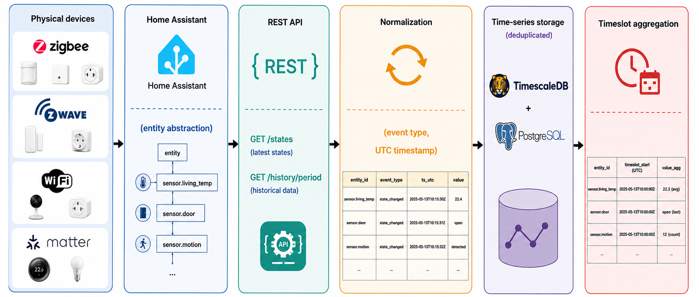
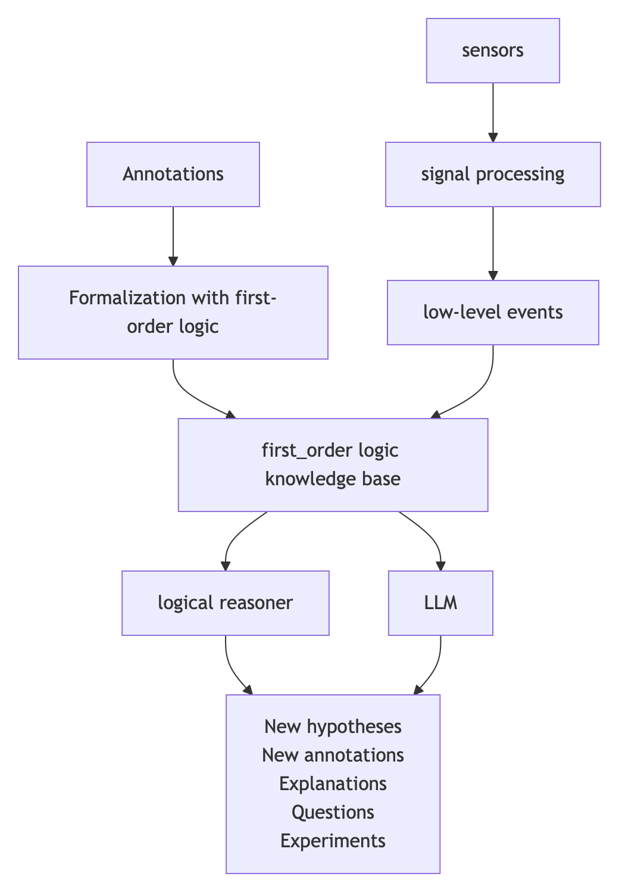
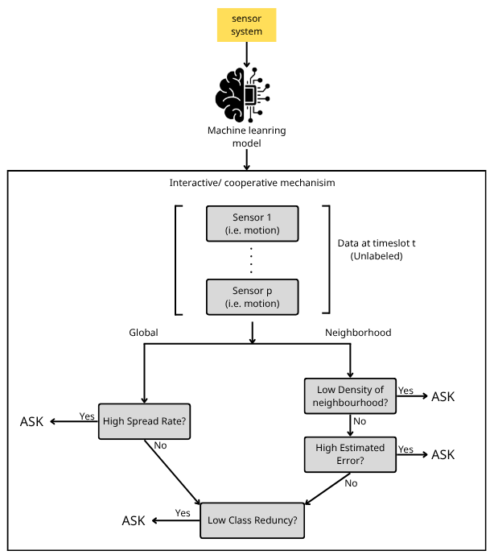
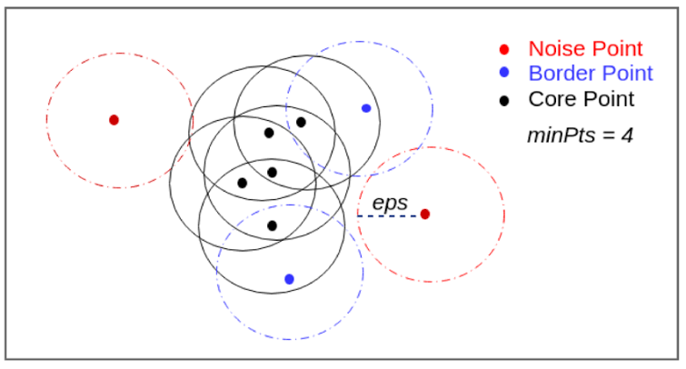
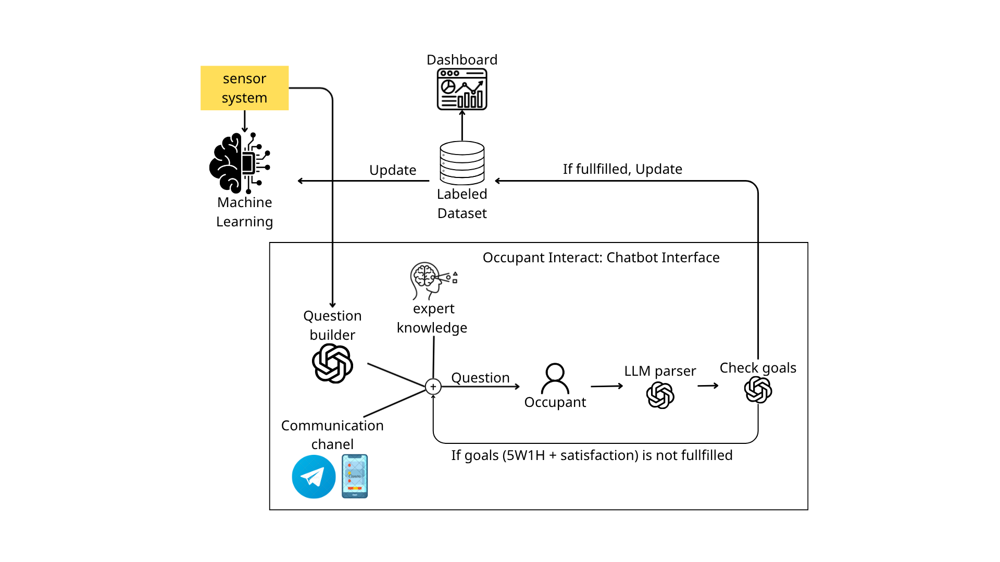
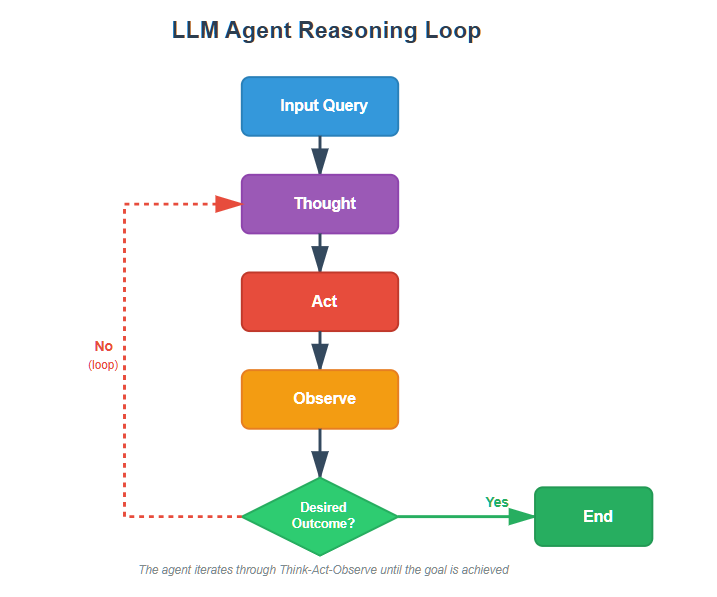
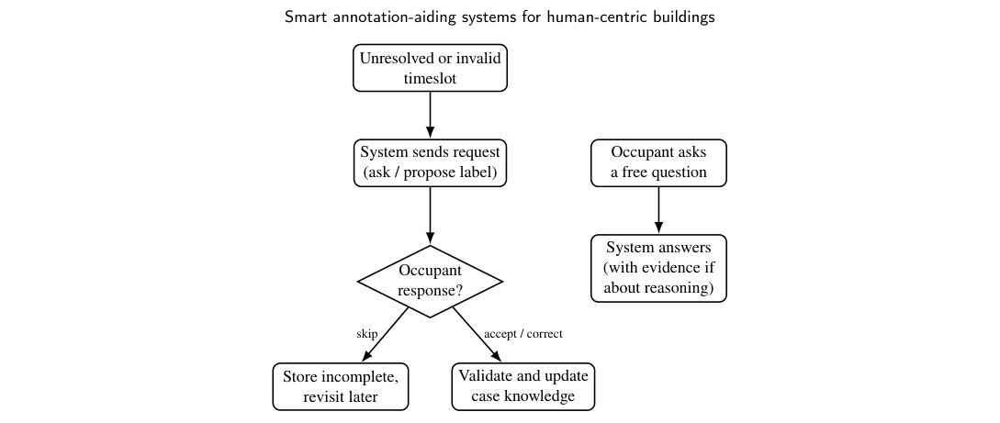

# Proposed Framework

[[Annotation aid system index|Index]] | [[03-problem-formulation|Previous]] | [[05-experiment|Next]]

In this study, with the objective of supporting occupant-centered annotation for residential energy-related experiments, we propose an annotation framework composed of three main modules: Data Collection, Label Assignment, and Quality Control. The overall goal is to transform raw sensor observations into timeslot-level representations and enrich them with semantic labels through interactive occupant feedback.

### 4.1. Data Collection

The first module, Data Collection, acquires the empirical evidence required by an inquiry. Given an inquiry ⟨𝑄, 𝑆, 𝑇−, 𝑇+, Γ⟩, only the sensors in 𝑆are monitored during the observation window delimited by 𝑇−and 𝑇+; data

acquisition is therefore inquiry-driven rather than exhaustive, collecting only the signals needed to support 𝑄and Γ instead of the whole household. As shown in Fig. 3, physical devices are not accessed directly: a retrieval layer exposes them through a query interface, normalizes their readings, and persists them so that later stages can reconstruct the selected sensing context. The implementation of this layer is described in Sections 4.1.1 and 4.1.2. 

*Figure 3:* Data Collection pipeline, from physical sensors to timeslot-level representations.

#### 4.1.1. Sensor Registration and Data Retrieval

Physical devices in the residence, such as smart plugs, motion sensors, contact sensors, or environmental sensors, may connect using heterogeneous wireless protocols, including Zigbee, Z-Wave, Wi-Fi, or Matter. Rather than implementing a separate retrieval pipeline for each protocol, the deployed system connects to physical devices through Home Assistant (Home Assistant, n.d.), which abstracts these protocols and exposes device information and sensor readings through a unified REST API. The REST API is preferred over the WebSocket interface that Home Assistant also offers because it exposes a broader set of endpoints and is simpler to integrate into the backend, which is implemented with FastAPI. Since the REST API does not push updates in real time, the backend instead polls Home Assistant on the schedule shown in Table 4; occupants can also trigger an on-demand refresh from the dashboard. To avoid re-fetching history on every cycle, each sensor resumes synchronization from a checkpoint of its last retrieved reading, and a newly added sensor is backfilled over the past week. Table 4: Synchronization schedule between the backend and Home Assistant. Synchronization target Frequency Device registry Every 30 minutes Sensor readings Every 1 minute On-demand refresh Triggered manually by the occupant from the dashboard

#### 4.1.2. Data Normalization and Storage

Readings retrieved from Home Assistant differ in naming conventions, units, attributes, and timestamp formats, and are therefore converted into a common event representation before being stored, as summarized in Table 5. Attributes that cannot be mapped to a known sensor or event type are discarded rather than stored. Table 5: Normalization applied when converting Home Assistant readings into stored sensor events.

Field Home Assistant representation Normalized representation Sensor / event type device_class or unit (power, °C, L/min, ...) event_type (power_w, temp_c, ...) and sensor_type (power_meter, motion, ...) Value state as a string (e.g. "235.5") value cast to float (e.g. 235.5) Timestamp last_changed, local time event_time, UTC Identifier entity_id (e.g. sensor.z1_power_...) source; entities of the same device are merged Filtering Unmapped device_class / unit Discarded After normalization, device metadata is stored in a regular PostgreSQL table, while sensor readings are stored in a TimescaleDB hypertable keyed by the composite of event_time and id, as detailed in Table 6. This allows readings to be retrieved through time-oriented operators such as time_bucket(), first(), last(), or sum(), while TimescaleDB’s built-in compression and retention policies keep long-term storage costs manageable as the event history grows. Table 6: Schema of the sensor-event hypertable. Column Type Description event_time / id TIMESTAMPTZ / VARCHAR(36) Composite primary key: reading timestamp and record UUID. source VARCHAR(128) Originating Home Assistant entity_id. event_type VARCHAR(64) Normalized event type. value DOUBLE PRECISION Normalized reading value. metadata JSONB Optional attributes, GIN-indexed. created_at / updated_at TIMESTAMPTZ Bookkeeping timestamps, default to insertion time. The collected stream nevertheless remains a low-level event history. Before it can support annotation, dialogue with occupants, or symbolic reasoning, it must be transformed into a representation that is both computationally usable and semantically interpretable; this transformation is addressed next.

### 4.2. Data Preprocessing

Residential sensors typically produce irregular, heterogeneous streams: some report periodically, others only on state changes, and their units and sampling rates differ. Preprocessing therefore converts the normalized event history stored in the time-series database into a regular timeslot representation and then into discrete semantic values that can be shared with occupants and with higher-level reasoning components.

#### 4.2.1. Discretization of sensor data

Let 𝑡𝑘denote the 𝑘-th timeslot. For each sensor 𝑠𝑖∈𝑆, the system builds a time series 𝑠𝑖(𝑡𝑘) over 𝑡𝑘∈[𝑇−, 𝑇+]. When useful for the inquiry, aggregate indicators are also derived, such as the energy consumed by an appliance, a room, or the dwelling over the experiment. Continuous measurements are then mapped to discrete domains 𝑑𝑖 ∈ 𝐷𝑖by an adjustable function 𝜙𝜃 𝑖. Discretization is not introduced only for compression. In the proposed framework it serves three purposes: • Human interpretability: occupants reason more naturally in terms of comfortable or high consumption than in terms of raw Celsius or watt values; • Language grounding: discrete levels provide a stable vocabulary for chatbot interaction and for LLM prompts; • Symbolic lifting: discrete values can be turned into first-order predicates without committing prematurely to brittle numerical thresholds inside logical rules. Table 7 gives representative domains.

Table 7: Examples of discrete domains after sensor-data discretization. Sensor / indicator Example discrete values Power at 𝑡𝑘 none, low, medium, high, very_high (or one total-consumption level after summing over the experiment) Indoor temperature at 𝑡𝑘 very cold, cold, slightly cold, comfortable, slightly hot, hot, very hot (or one averaged level over the experiment) Motion no_motion, motion Door / window open, closed Light on, off Presence / sound detected, not_detected Because perception is household-specific, the thresholds 𝜃are adjustable. An occupant who contests a reported level—for example, rejecting a temperature labelled as comfortable—provides feedback that can recalibrate 𝜙𝜃 𝑖. Discretization thus participates in the inquiry loop: it translates physical measurements into shared semantic categories that both the occupant and the system can discuss, revise, and reuse.

#### 4.2.2. First-order logic representation

Discretized observations remain fragmented unless they are organized as explicit knowledge. The framework therefore encodes each timeslot with first-order logic (FOL) formulas. FOL is chosen because it can express objects, relations, and rules in a form that is machine-checkable, explainable, and sufficiently textual for LLMs to consume. A formula is built from symbols that denote: • objects (people, rooms, appliances), • events and activities (cooking, sleeping, opening a window), • relationships (presence in a room, use of an appliance), • contextual or causal knowledge relevant to the inquiry. Typical predicates include • DoorOpen(𝑑𝑜𝑜𝑟, 𝑡𝑖𝑚𝑒), • PowerConsumption(𝑑𝑒𝑣𝑖𝑐𝑒, 𝑣𝑎𝑙𝑢𝑒, 𝑡𝑖𝑚𝑒), • Cooking(𝑝𝑒𝑟𝑠𝑜𝑛, 𝑡𝑖𝑚𝑒), • Using(𝑝𝑒𝑟𝑠𝑜𝑛, 𝑑𝑒𝑣𝑖𝑐𝑒, 𝑡𝑖𝑚𝑒). Functions such as RoomOf(𝑑𝑒𝑣𝑖𝑐𝑒) or Duration(𝑎𝑐𝑡𝑖𝑣𝑖𝑡𝑦) may enrich these statements. Sensor-derived facts are obtained by lifting discretized readings. For instance: • a kitchen motion trigger at 𝑡1 becomes Motion(𝐾𝑖𝑡𝑐ℎ𝑒𝑛, 𝑡1); • appliance events may yield Open(𝐹𝑟𝑖𝑑𝑔𝑒𝐷𝑜𝑜𝑟, 𝑡2); • or SwitchOn(𝐶𝑜𝑓𝑓𝑒𝑒𝑀𝑎𝑐ℎ𝑖𝑛𝑒, 𝑡3). These facts constitute the evidential layer of the inquiry: they describe what was observed, not yet why it occurred. Higher-level activities are usually inferred. The activity Cooking(𝐴𝑙𝑖𝑐𝑒, 𝑡) (9) is rarely measured by a dedicated sensor; it can be deduced from co-occurring evidence such as • InRoom(𝐴𝑙𝑖𝑐𝑒, 𝐾𝑖𝑡𝑐ℎ𝑒𝑛, 𝑡),

• Using(𝐴𝑙𝑖𝑐𝑒, 𝑆𝑡𝑜𝑣𝑒, 𝑡), • Using(𝐴𝑙𝑖𝑐𝑒, 𝐹𝑟𝑖𝑑𝑔𝑒, 𝑡), through a rule of the form ∀𝑝, 𝑡Using(𝑝, 𝑆𝑡𝑜𝑣𝑒, 𝑡) ∧Using(𝑝, 𝐹𝑟𝑖𝑑𝑔𝑒, 𝑡) →Cooking(𝑝, 𝑡). (10) Temporal structure can likewise be made explicit. A cooking-related sequence Open(𝐹𝑟𝑖𝑑𝑔𝑒) →Take(𝐹𝑜𝑜𝑑) →Use(𝑆𝑡𝑜𝑣𝑒) →Eat(𝐹𝑜𝑜𝑑) (11) may be accompanied by relations such as • Before(𝑡1, 𝑡2), • Occurs(Open(𝐹𝑟𝑖𝑑𝑔𝑒), 𝑡1). Contextual conditions such as weekday, time of day, occupancy, or outdoor temperature enter the same language, enabling rules such as Weekday(𝑑) ∧Morning(𝑡) ∧CoffeeMachineOn(𝑡) →Breakfast(𝑡). (12) Importantly, the inquiry itself is represented symbolically. For the question “Does opening windows reduce my electricity consumption?”, one may introduce • Experiment(𝐸1), • Question(𝐸1, 𝑅𝑒𝑑𝑢𝑐𝑒𝐶𝑜𝑛𝑠𝑢𝑚𝑝𝑡𝑖𝑜𝑛𝐵𝑦𝑊𝑖𝑛𝑑𝑜𝑤𝑂𝑝𝑒𝑛𝑖𝑛𝑔), • Participant(𝐸1, 𝐴𝑙𝑖𝑐𝑒), • Starts(𝐸1, 𝑡1), Ends(𝐸1, 𝑡2). Observations such as • Open(𝑊𝑖𝑛𝑑𝑜𝑤, 𝑡), • PowerConsumption(𝑣𝑒𝑟𝑦_ℎ𝑖𝑔ℎ) then become evidence for or against a hypothesis, e.g. WindowOpen(𝑡) →LowerHeatingPower(𝑡). (13) An occupant annotation such as “Alice is preparing dinner” is stored as PreparingDinner(𝐴𝑙𝑖𝑐𝑒, 𝑡), (14) not as a disposable training label, but as a reusable assertion in the knowledge base. This representation changes what annotation means in the system. Labels are no longer opaque class identifiers attached to feature vectors; they are logical statements that can be queried, composed, and checked. For example, ∃𝑡Cooking(𝐴𝑙𝑖𝑐𝑒, 𝑡) asks whether cooking occurred, while ∃𝑡Cooking(𝐴𝑙𝑖𝑐𝑒, 𝑡) ∧HighPowerConsumption(𝑡) (15) asks whether cooking coincided with high electricity use—a question directly aligned with energy-oriented inquiry. A case is not created by FOL; it is detected upstream by 𝐷(Section 3.1.3) and only represented in FOL once facts about it are formalized. All facts concerning the same case share its identifier, so that they can be retrieved and reasoned about together. For a dishwasher case 𝑐4, this may include • EnergyWh(𝑐4, 450),

• DurationMinutes(𝑐4, 60), • UsesProgramme(𝑐4, 𝐻𝑎𝑙𝑓𝐿𝑜𝑎𝑑), • InitialSoil(𝑐4, 𝑆𝑙𝑖𝑔ℎ𝑡𝑙𝑦𝐷𝑖𝑟𝑡𝑦), • WashingResult(𝑐4, 𝐶𝑙𝑒𝑎𝑛). The first two facts are lifted directly from sensor-derived indicators; the remaining three become available only once the corresponding annotations have been accepted. The knowledge base as a whole contains many such case-scoped facts together with relations, rules, questions, and experiments; it is not equivalent to any single case.

#### 4.2.3. LLMs and first-order logic

FOL and LLMs play complementary roles. Symbolic reasoners are reliable for deduction and consistency checking, but brittle when evidence is incomplete or when the mapping from everyday language to formal structure is ambiguous. LLMs are strong at interpreting natural language and proposing plausible explanations, but weak at guaranteeing logical soundness. The architecture therefore uses FOL as a shared interface between the two. Because predicates are structured text, an LLM can read facts such as • InRoom(𝐴𝑙𝑖𝑐𝑒, 𝐾𝑖𝑡𝑐ℎ𝑒𝑛, 08∶12), • SwitchOn(𝐾𝑒𝑡𝑡𝑙𝑒, 08∶13), • Open(𝐹𝑟𝑖𝑑𝑔𝑒, 08∶14) much more effectively than raw records of the form "sensor": 4, "value": 1. In practice, the reasoning pipeline first converts discretized sensor evidence into logical facts; the LLM then receives those facts together with an occupant question, for example “What activity is most likely occurring?”. It may answer abductively—suggesting breakfast from a kitchen–fridge–kettle pattern—without accessing the underlying continuous measurements. The exchange is bidirectional. From a set of observed facts, the LLM may propose candidate assertions such as • Cooking(𝐴𝑙𝑖𝑐𝑒, 08∶03), • PreparingMeal(𝐴𝑙𝑖𝑐𝑒, 08∶04), optionally with a confidence score. These candidates are proposals, not accepted knowledge: they enter the knowledge base as accepted facts only once they have been validated symbolically and/or confirmed by the occupant. In this way, language models enrich the inquiry with semantic hypotheses and explanations, while FOL preserves an explicit, inspectable record of what has actually been accepted as knowledge.

#### 4.2.4. Annotation-aiding system architecture

*Figure 4:* Shared-representation architecture between first-order logic and an LLM. The figure shows how the two components communicate through the logical layer; it does not depict the chronological order of the end-to-end inquiry flow (Figure 2). Figure 4 summarizes the resulting pipeline. Natural-language utterances from occupants are mapped to logical predicates or goals; sensor streams are discretized and lifted into the same FOL vocabulary; a symbolic reasoner performs deduction and consistency checks; and an LLM supports dialogue, abduction, and explanation. Both components communicate through the shared logical layer rather than through ad hoc text or opaque embeddings alone. Within this architecture, annotation is a knowledge-acquisition act embedded in the inquiry. Occupants ask questions in natural language; the system gathers the corresponding sensor evidence; missing semantic dimensions are requested when needed; accepted annotations become logical assertions; and the LLM can later explain relations or suggest further experiments. FOL thus operates as a semantic protocol among sensors, reasoners, occupants, and language models, supporting explainable and inquiry-driven smart-home intelligence beyond the conventional use of annotations as ground-truth labels for supervised learning.

### 4.3. Label Assignment

The second module, Label Assignment, acquires or proposes semantic annotations for timeslot-level sensor data through an interactive learning process: for each detected sensing context, an ask/no-ask trigger decides whether to reuse or suggest a supported annotation directly, or to ask the occupant instead—either branch yielding a candidate annotation. Instead of treating annotation as a one-step classification task, this module first determines whether a timeslot’s context is already sufficiently supported to be resolved automatically or should generate an interaction with the occupant. If the available information is sufficient, the system proposes the annotation directly and stores the result in the annotation corpus. Otherwise, the timeslot is selected as an ask, meaning that additional occupant feedback is required before the candidate annotation can be finalized.

#### 4.3.1. Trigger Mechanism — Ask or not

Within the current scope of this study, we adopt the trigger mechanism proposed by Silva et al. (2022) as the basis for deciding when user feedback should be requested. As illustrated in Fig. 5, the trigger mechanism evaluates whether the current sensing context is informative enough to justify an interaction. The decision can be based on neighborhood-based criteria, such as local density and classifier estimation error, or global criteria, such as spread rate. Label redundancy can be used in both branches to ensure that each label has sufficient support in the knowledge database. These criteria help the system avoid unnecessary questions while still collecting labels for uncertain, sparse, or underrepresented contexts. Table 8 summarizes the trigger criteria, their hyper-parameters, and their corresponding decision branches. 

*Figure 5:* Trigger mechanism for deciding whether a timeslot should generate an ask. Table 8: Trigger criteria used in the interactive learning mechanism

Criterion Hyper-parameters Branch Meaning Density of the neighborhood 𝜖; minimum number of neighbors Neighborhood Ask when the current context has too few labelled neighbors. Related to local coverage-based active learning and density-based methods such as DBSCAN. Classifier estimation error Maximum acceptable estimation error Neighborhood Filters unreliable neighbors based on classifier error. Ensures local consistency and reduces noise. Label redundancy Minimum number of occurrences per label Neighborhood / Global Ensures that each label has enough examples. Spread rate Improvement ratio Global Ask when the current sample improves global coverage. The density-based trigger criterion can be understood through a simple analogy with DBSCAN.As shown in Fig. 6, a point that has enough neighbors can be considered well supported, while a point with too few neighbors may be treated as noise. Similarly, in our annotation system, a sensing context that has not been sufficiently observed or labelled before can be regarded as an unfamiliar point. Instead of discarding it, the system treats it as a candidate that needs confirmation from the occupant.Therefore, when the current timeslot has too few labeled neighbors, an ask is generated to verify its semantic meaning and improve the labeled knowledge database. 

*Figure 6:* Illustration of the neighborhood density concept in DBSCAN.A low-density point can be interpreted as an unfamiliar context that requires user confirmation. Among these criteria, the current deployment activates only the density-of-the-neighborhood criterion. Because the annotation target is not a single-label activity class but a structured, partly open-ended set of 5W1H-style semantic fields together with occupant satisfaction, the classifier-based criteria remain less reliable until a larger and more consistent labelled corpus is available. The concrete hyper-parameters of the active criterion are specified together with the experiment in Section 5.

#### 4.3.2. Chatbot Interaction and Annotation Workflow

At the beginning of each day, the module builds an annotation schedule for every active experiment from its asking window, timestep length, and maximum number of daily asks, merging the timeslots of all experiments into a single

daily schedule. When a scheduled timeslot is reached, its sensor readings are aggregated into a timeslot-level feature vector, following the discretization described in Section 4.2.1, and evaluated against the trigger criterion. If the timeslot is selected as an ask, the system constructs an annotation request from three sources of information—the target timeslot, the metadata of the sensors involved in the experiment, and the current label state of that timeslot—and the LLM generates a user-facing question sent through the Telegram bot, as shown in Fig. 7. 

*Figure 7:* Illustration of user interaction through the Telegram-based annotation interface As illustrated in Fig. 8, the conversational agent then repeatedly reasons over the current annotation goal, acts by generating a question or parsing the occupant’s reply, and observes the updated annotation state, updating the annotation field by field until the required semantic fields are complete. If a timeslot cannot be resolved by the end of the day, it is retained as an unfinished annotation rather than discarded. Completed annotations feed back into the annotation corpus used by the trigger mechanism, so that timeslots resembling previously annotated ones are increasingly resolved automatically and the frequency of occupant interruptions decreases as that corpus grows.

*Figure 8:* Goal-based reasoning loop followed by the conversational agent during interactive label assignment.

#### 4.3.3. Implementation Setup

This module is implemented as a dedicated service, decoupled from the main backend, so that the interactive learning loop and the resulting annotations remain isolated from the rest of the system. Rather than exchanging data through dedicated API endpoints, the module accesses experiment metadata and sensor readings directly from the shared database and persists annotations to its own store, keeping the label layer separated from the backend. Table 9 summarizes the implementation setup. Table 9: Implementation setup of the label assignment module. Component Configuration Service framework FastAPI and Uvicorn. Runtime environment Docker with the python:3.12.3-slim image. ML library scikit-learn, used for feature scaling and encoding of the labelled dataset. LLM orchestration LangChain / LangGraph, driving a goal-based conversational agent. Language model gpt-4o-mini, accessed through OpenRouter. User-facing interface Telegram Bot. Each experiment defines the metadata used to schedule and bound the annotation process. The asking window and timestep define when and how often timeslots are evaluated, while the maximum number of asks per day caps how many questions an occupant may receive for a given experiment within a single day. The metadata fields are: • Asking window — the daily time interval during which the system is allowed to send annotation questions to the occupant; • Timestep length — the temporal resolution of the interactive learning process, determining the length of each timeslot and the daily annotation schedule; • Maximum asks per day — the maximum number of questions that may be sent for the experiment within a single day;

• Selected sensors — the set of sensors associated with the experiment, defining which sensor readings are retrieved for each timeslot. Each resolved timeslot is stored as an annotation record that realizes the 5W1H schema of Eq. 5, together with the occupant’s satisfaction, a short activity label summarizing the annotated activity, and a completion status. The activity label acts as the target class fed back into the labelled dataset that drives the trigger mechanism. An annotation is only marked complete once its required semantic fields have been filled in; incomplete annotations are retained with this status left unset rather than being discarded.

### 4.4. Quality Control - Occupant Interaction

Following the principle of inclusive management, a system that supports occupants operates as a cooperative process between humans and machines, in which the aim is not to replace human judgment but to support it (Ploix et al., 2026). Within this cooperation, the system is responsible for collecting and organizing data and for detecting situations that deserve attention, while the occupant is responsible for observing, interpreting, and providing annotations that reflect their own perception of the situation. We organize Occupant Interaction into two complementary channels: Real-time Interaction (Section 4.4.1), conducted through a chat channel, which includes both the system proactively requesting or confirming information and the occupant freely asking questions and receiving explanations from the system; and Reflective Interaction (Section 4.4.2), conducted through a web dashboard, where the occupant independently reviews charts, analyses, and past annotation logs. Cooperative learning is the strategy that governs this repair: whenever an annotation reaching Quality Control (Section 3.2.3) is found incomplete, uncertain, or conflicting with prior cases, it is not silently accepted or discarded. Instead, the occupant is presented with the annotation and the reason it was flagged, and can confirm it as correct, amend it, reject it, or leave it unresolved for later reconsideration. An unresolved or rejected item can, in turn, generate a new interactive-learning request (Section 4.3) rather than entering the case knowledge silently. This keeps the occupant the authority on household meaning while the system’s case knowledge becomes progressively more reliable; it is a repair strategy embedded in Quality Control, not a separate, independently deployed module.

#### 4.4.1. Real-time Interaction

The system sends a real-time interaction whenever a timeslot is left unresolved by Label Assignment (Section 3.2.2) or flagged as invalid by Quality Control (Section 3.2.3), following the interactive and cooperative learning strategies described in del Castillo Cardoso (2025). Each request is anchored to the corresponding sensor context, such as the time, duration, and measurement values involved, and the occupant may also ask why the annotation is needed before responding. When the sensor configuration is not detailed enough to distinguish between appliances sharing the same sensor, for example a TV and a sound system connected through the same smart plug, the system reports this limitation to the occupant, who may choose to report each use individually so the devices can be separated, or accept grouping them under a single label. To keep the level of interaction acceptable over time, requests are only raised when confidence falls below a threshold, are not repeated for previously confirmed situations, and are capped within a given period. The occupant may also initiate the interaction by freely asking questions through a natural-language interface, about recorded consumption, practical recommendations, or the reasoning behind a given recommendation; in the latter case, the system supports its answer with evidence, such as the number of similar past cases and the average improvement observed among them. Both flows are summarized in Fig. 9.

Unresolved or invalid timeslot System sends request (ask / propose label) Occupant response? Store incomplete, revisit later Validate and update case knowledge Occupant asks a free question System answers (with evidence if about reasoning) skip accept / correct 

*Figure 9:* Overview of Real-time Interaction. The system-initiated flow (left) is triggered by Label Assignment or Quality Control; the occupant-initiated flow (right) runs independently through the same chat channel.

#### 4.4.2. Reflective Interaction

The occupant creates an experiment for the devices they wish to monitor and can then access a dashboard to track its progress, including energy consumption statistics, annotation statistics, and a list of pending questions that can be answered directly on the dashboard. To help the occupant understand their own behavior and how the system supports it, they can review the annotation history, which includes both information inferred by the system and information provided by the occupant, and adjust it when needed. The system also provides a mechanism for comparing usage cases, helping the occupant determine whether a change in behavior achieves the desired outcome.

