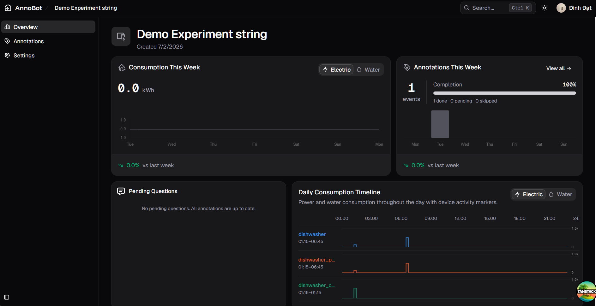
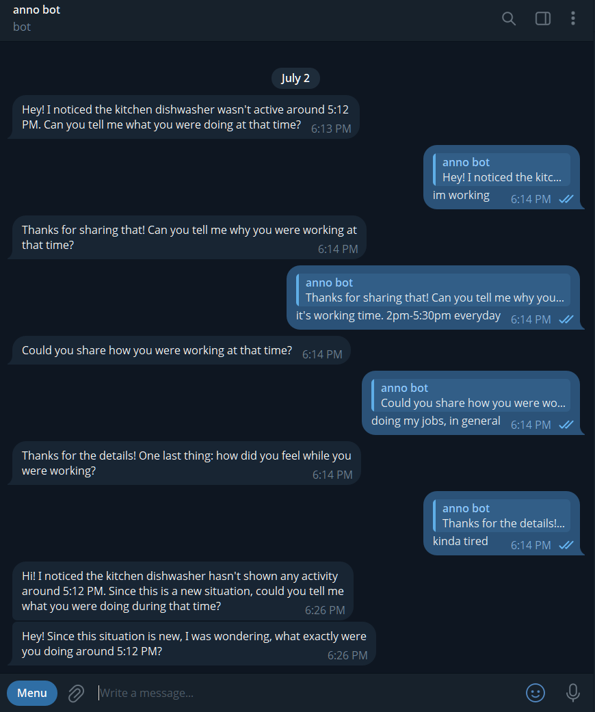
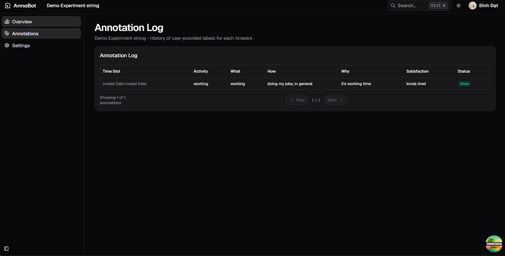

# Experiment

[[Annotation aid system index|Index]] | [[04-proposed-framework|Previous]] | [[06-conclusion|Next]]

This section selects the target activity for evaluating AnnoBot, instantiates the corresponding inquiry and experiment plan, and reports the results obtained so far.

### 5.1. Activity Selection and Rationale

The choice of the target activity determines which sensor data are collected, which semantic dimensions require annotation, and which questions drive the interaction with occupants. Because AnnoBot collects a structured 5W1H description together with satisfaction rather than a single activity label, the primary selection criterion is the diversity of the semantic information an activity gives rise to. We therefore select the activity on two groups of criteria. Quality criteria assess how well an activity exercises the system: the diversity of the semantic dimensions it produces, the separation between the sensor-observable fact layer and the part that requires human input, and the support it offers for learning an estimation model. Feasibility criteria assess whether the activity can actually be monitored: the availability of sensor infrastructure and of participants are mandatory, while activity frequency and annotation burden are favourable. Two candidate activities are available in the instrumented building. The meeting room targets team meetings and presentations: motion indicates whether the room is occupied, CO2 reflects how crowded it is, door contact marks entries and exits, sound level distinguishes discussion from silence, and TV power indicates whether the presentation device is on. Most of the semantic information, however—how many people attend, what equipment is used, why the meeting is held, how it is conducted, and how satisfied participants are with the air quality—must be provided by the occupants, which is exactly what creates the diversity to be annotated. The kitchen targets cooking or reheating food with a microwave and taking items from a refrigerator: its fact layer reduces to microwave on/off and refrigerator cycles, so information such as the food type, the meal, who is cooking, and the satisfaction must be provided by the occupants.

Table 10 compares the two candidates on the decisive criteria. Table 10: Comparison of the two candidate activities on the decisive selection criteria. Criterion Meeting room Kitchen Semantic diversity Five dimensions (5W1H + satisfaction), all varying strongly across meetings Five dimensions but narrow variation (who is 1–2 people, why is 1–2 meals per day) Fact vs. semantic layer Rich fact layer: occupancy, crowding, entries/exits, discussion, presentation Thin fact layer: microwave on/off, refrigerator cycles Estimation model Number of people from CO2 (Jiang et al., 2016); meeting state from motion, sound, and power (Silva et al., 2022) Only on/off and NILM (Zoha et al., 2012); who/why/satisfaction have no sensor correlate The meeting room is superior or tied on every criterion. The decisive difference is the separation between the annotation-free and annotation-based layers and the possibility of learning an estimation model: in the meeting room the fact layer is rich enough for the system to recognise an event before asking the occupant, and the semantic dimensions all correlate with the sensors and can thus be learned from the (sensor →annotation) pairs; in the kitchen, the who/why/satisfaction dimensions have no sensor correlate to learn from. The meeting room is therefore selected as the deployment target. For this activity, the annotation target instantiates the timeslot label of Eq. 5: who is the number of attendees, what the equipment used, where the (fixed) meeting room, when the duration, why the purpose, how the conduct, and satisfaction the participants’ comfort with air quality and temperature. The sensor-derived dimensions (who via CO2 and motion, what via TV power, when via door and motion) complement the annotation-based ones (why, how, satisfaction).

### 5.2. Inquiry Questions and Experiment Plan

Following the inquiry tuple of Eq. 2, the meeting-room experiment 𝐸meeting = ⟨meeting, 𝑇meeting⟩groups four inquiries meeting = {𝜄1, 𝜄2, 𝜄3, 𝜄4} under a single experiment-level listening period 𝑇meeting spanning two working weeks; two inquiries are answerable from sensor-derived facts alone and two require annotation. They instantiate the abstract examples of Table 2 with concrete meeting-room content, as summarised in Tables 11 and 12. Table 11: Inquiry questions for the meeting-room experiment. Question 𝑄 Goal Γ Recognition 𝜄1 “How many people attended, what was the temperature, and which equipment was used?” Measure occupancy, temperature, equipment annotation-free 𝜄2 “Where does the meeting consume the most energy?” Decompose energy by source annotation-free 𝜄3 “With the same number of people and weather, is setpoint A more comfortable and economical than setpoint B?” Evaluate comfort– energy trade-off annotationbased 𝜄4 “Why did yesterday’s meeting consume more energy than usual?” Explain an energy anomaly annotationbased All four inquiries share the same sensor configuration 𝑆= {CO2, motion, sound, door, TV power, temperature, humidity}

and the same detection rule 𝐷: a meeting episode is bounded by door and motion transitions, yielding [𝑡start, 𝑡end] for each occurrence within 𝑇meeting. They differ in the indicators 𝐼they read from that episode and in the annotation scope 𝐴they require, summarised in Table 12. Table 12: Per-inquiry configuration for the meeting-room experiment (𝑆and 𝐷are shared, as described above). Indicators 𝐼 Annotation scope 𝐴 𝜄1 Attendee count (from CO2 and motion), average temperature, equipment usage none required; who is additionally annotated to provide ground truth for the attendee-count estimation model 𝜄2 Energy consumption decomposed by source over the episode none 𝜄3 Average temperature, humidity, and energy consumption per setpoint what (setpoint used) and satisfaction (perceived comfort) 𝜄4 Energy consumption of the episode relative to comparable past episodes why (occupant’s explanation of the anomaly) and satisfaction The deployment reuses the trigger configuration of Section 4.3, namely the density-of-the-neighborhood criterion with 𝜖= 0.3 and 𝑁min = 3, with an asking window from 09:00 to 21:00, a 30-minute timestep, and a maximum of 10 asks per day. Across the annotation-based inquiries (𝜄3, 𝜄4), what, why, and satisfaction are mandatory annotated fields, while who and when are instead inferred from the sensors (the attendee count from CO2 and motion, the duration from door and motion).

### 5.3. Data Characteristics

Although the proposed system includes a data collection module for acquiring sensor events from real residential environments, the current implementation could not yet be deployed in an actual household setting due to time constraints. Therefore, in this experiment, we used an existing dishwasher-related dataset to simulate the sensor data that would normally be collected by the data collection module. This allows the experiment to evaluate the downstream workflow of the system, including sensor-event visualization, event selection, and interactive label assignment, under a realistic time-series setting while postponing full real-world deployment to future work. Following the experiment formulation in Section 3.1, the dishwasher activity use case can be defined as an experiment containing a single inquiry, 𝐸dishwasher = ⟨{𝜄dishwasher}, 𝑇dataset⟩, 𝜄dishwasher = ⟨𝑄dishwasher, 𝑆dishwasher, 𝐼dishwasher, 𝐷dishwasher, 𝐴dishwasher, Γdishwasher⟩. (16) In this use case, the inquiry question 𝑄dishwasher is concerned with understanding dishwasher-related activity and its relationship with appliance power consumption. A representative question is: Which mode of the dishwasher is more cost-effective, and when should I use that mode? The selected sensor configuration 𝑆dishwasher consists of dishwasher-related sensor signals available in the dataset, mainly the appliance-level power consumption signal represented by CUI_power_dishwasher and dishwasher. These signals simulate the data that would be collected from a smart plug or appliance-level power meter attached to the dishwasher. The detection rule 𝐷dishwasher identifies a washing cycle from the power signal and returns its [𝑡start, 𝑡end]; the resulting energy consumption is the indicator 𝐼dishwasher (Eq. 3). The experiment-level listening period 𝑇dataset corresponds to the observation period covered by the dataset, from 2019-09-01 06:00 to 2019-12-30 22:30, with a 30-minute sampling interval. The selected dataset represents a kitchen activity scenario related to dishwasher usage. It contains time-series observations sampled every 30 minutes from 2019-09-01 06:00 to 2019-12-30 22:30. The dataset consists of

4,114 records and 11 columns, with no missing values. Each day contains 34 fixed timestamps, corresponding to the interval from 06:00 to 22:30. Thus, the dataset does not represent a complete 24-hour daily sequence, but rather a fixed daytime observation window. Table 13 summarizes the main characteristics of the dataset used in this experiment. Table 13: Summary of the dishwasher activity dataset. Characteristic Value Dataset file CESTAS_kitchen_wash_dishes.csv Number of records 4,114 Number of columns 11 Observation period 2019-09-01 to 2019-12-30 Number of observed days 121 Sampling interval 30 minutes Daily observation window 06:00–22:30 Number of time steps per day 34 Missing values 0 Main sensor signal Dishwasher power consumption Main activity labels wash dishes, wash dishes start

### 5.4. Results

As a preliminary validation of the implemented pipeline, the following results were obtained using a dishwasher dataset before the meeting-room deployment was available.

#### 5.4.1. System Result Visualization

After loading the dishwasher dataset into the implemented system, the simulated sensor events were visualized through the AnnoBot dashboard. Figure 10 shows the result of this process. The dashboard provides an overview of the experiment, including weekly consumption, annotation progress, pending questions, and a daily consumption timeline. In the daily timeline, dishwasher-related signals are displayed as temporal event traces, allowing the user to inspect when the dishwasher was active and how the activity was distributed across the day. 

*Figure 10:* Dashboard result for the dishwasher activity use case after importing the simulated sensor events into AnnoBot.

This result demonstrates that the implemented system can ingest dishwasher-related time-series data, represent it as sensor-event timelines, and present the information in a form that supports annotation and inspection. The dashboard also shows the integration between the simulated data collection output and the annotation management interface. In this example, the system reports one annotation event for the selected week and indicates that the annotation process has been completed. This provides preliminary evidence that the proposed workflow can connect sensor-event visualization with the label assignment process.

#### 5.4.2. Interactive Learning Result

The implemented label assignment module was tested through the Telegram-based chatbot interface. As shown in Fig. 11, the system was able to send annotation questions to the user, receive textual replies, and continue the interaction with follow-up questions. This confirms that the communication loop between the backend, the LLM-based annotation agent, and the Telegram interface operated correctly during testing. The interaction was stable in both the Telegram mobile application and Telegram Web. Users in the testing phase were able to receive system-generated questions and respond directly through the chat interface. The chatbot also maintained the iterative annotation flow by asking one semantic field at a time, such as the user’s activity, reason, manner of performing the activity, and satisfaction state. These observations indicate that the current implementation can support real-time interactive label collection through a familiar messaging interface.

*Figure 11:* Example of the Telegram-based chatbot interaction during label assignment testing.

#### 5.4.3. Annotation Result

After the system detected or selected a relevant dishwasher-related time slot, the annotation was completed through the chatbot-based label assignment process. The user-provided responses were then stored and displayed in the annotation log interface. Figure 12 shows the resulting annotation record after the interaction was completed. 

*Figure 12:* Annotation log after completing the chatbot-based label assignment process. The annotation log presents the semantic labels collected for the selected time slot. Instead of storing only lowlevel sensor values, the system records user-provided contextual information according to the selected annotation dimensions, including the activity, what the user was doing, how the activity was performed, why it was performed, and the user’s satisfaction state. In the illustrated example, the annotation status is marked as Done, indicating that the annotation flow was successfully completed and the resulting semantic label was saved by the system.

### 5.5. Evaluation Metrics

The evaluation follows AnnoBot’s goals of accuracy and reduced user burden, drawing on the interactive-learning evaluation of the laboratory’s prior work (Amayri et al., 2019; Silva et al., 2022). Table 14 summarises the core metrics. Table 14: Core evaluation metrics.

Metric Meaning Source Timeslot skip rate fraction of the annotation burden removed by interactive learning (skipped / total), which should grow over time annotation statistics User response rate whether questions are asked at the right time and are understandable (target > 80%) AI service log Questions per annotation whether the AI asks to the point given the five fields (what/why/how/satisfaction/activity) conversation log Sensor data coverage whether every timeslot has sensor data and the sensors actually report sensor events Annotation quality fraction of timeslots fully annotated, with all fields filled and the activity label set annotations

